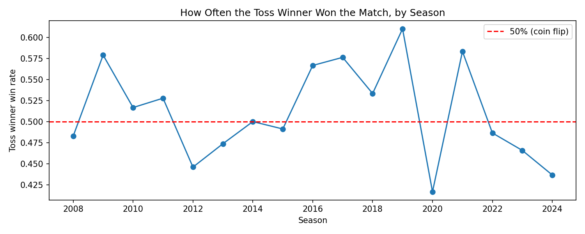
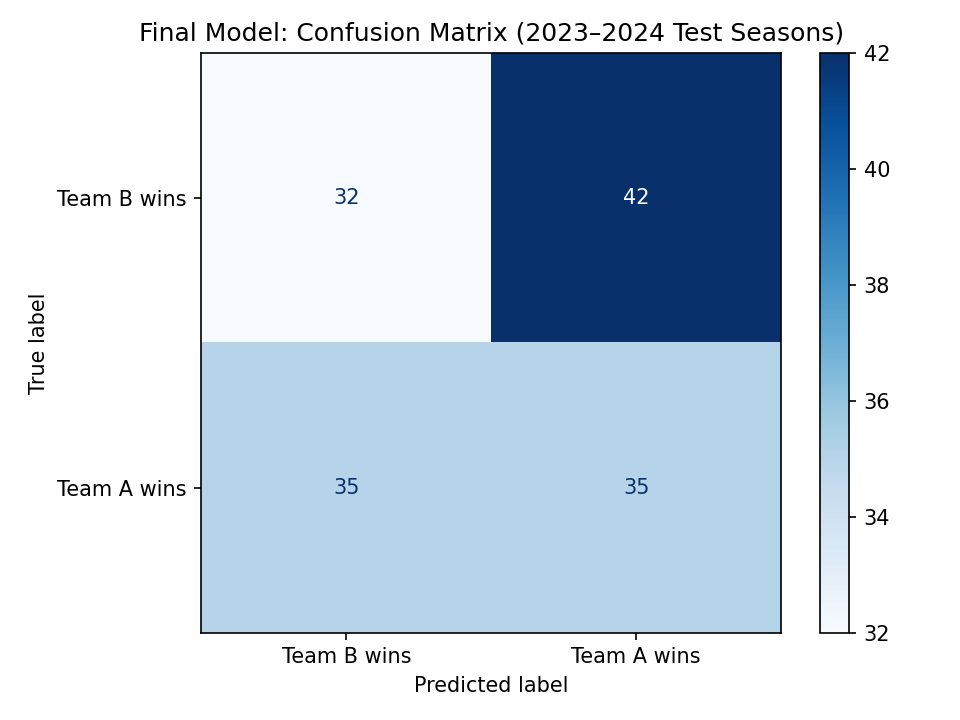
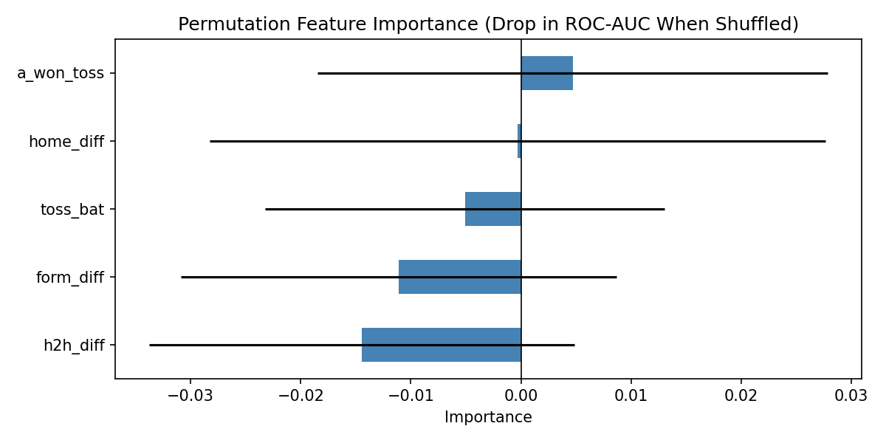

# Predicting IPL Match Winners from Pre-Match Information

DTSC 2301 Portfolio Project Two, UNC Charlotte

**Research question:** Can pre-match information (recent form, head-to-head record, venue, and toss) predict the winner of an IPL match?

## Where the Data Came From
I used the IPL Complete Dataset (2008–2024) by Patrick B. on Kaggle, which is originally sourced from Cricsheet. I used `matches.csv`, where each row is one IPL match (1,095 matches across 17 seasons), with the teams, date, city, venue, toss winner, toss decision, and winner.

Patrick B. (2024). *IPL complete dataset (2008–2024)* [Data set]. Kaggle. https://www.kaggle.com/datasets/patrickb1912/ipl-complete-dataset-20082020

## What I Did With It
1. **Cleaned the data:** converted dates, created a clean `year` column, merged renamed teams (e.g., Delhi Daredevils → Delhi Capitals), standardized city names, and removed 5 no-result matches, leaving 1,090.
2. **Built pre-match features** using only matches played *before* each game, so nothing leaks from the future:
   - **Recent form:** each team's win rate over its last 5 matches
   - **Head-to-head:** each team's previous wins against the opponent
   - **Home advantage:** whether the match was in the team's home city
   - **Toss:** who won the toss and whether they chose to bat
3. **Randomly assigned Team A and Team B** for each match, because the raw `team1` column was usually the home team. This gave a balanced target (Team A won 50.8%).
4. **Trained and compared two models** (logistic regression and random forest) on 2008–2022, then tested them on 2023–2024, seasons the models never saw.

## Results
Neither model beat a simple 50% baseline. The final random forest reached **46.5% accuracy (ROC-AUC 0.471)** on 2023–2024, and time-series cross-validation within 2008–2022 gave similar results. These pre-match factors carry little predictive signal for IPL outcomes.

## What the Graphs Show

### Toss Winner Win Rate by Season

This line shows, for each season, the percentage of matches won by the team that won the coin toss. The red dashed line marks 50%, a coin flip. The line stays close to 50% in most seasons, so winning the toss gives little real advantage. In 2023–2024 the toss winner won only 45.1% of matches.

### Confusion Matrix (2023–2024 Test Seasons)

This grid compares the model's predictions (columns) with what actually happened (rows) for the 144 test matches. The diagonal boxes are correct predictions; the other two are mistakes. The model got 67 right and 77 wrong, with errors spread evenly, so it does no better than guessing.

### Permutation Feature Importance

Each bar shows how much the model's ROC-AUC drops when that feature is randomly shuffled. A bigger positive bar means the model relied on that feature more. The black lines show the uncertainty. Every line crosses zero, so no feature reliably helped. Head-to-head and form differences were slightly negative, meaning patterns from older seasons did not hold in 2023–2024. 

### References
Lal, A., Willis, D., Sood, G., & Acharya, A. (2023). Fairly random: The effect of winning the toss on winning the match. *Journal of Sports Analytics*. https://science.ecosyste.ms/projects/30509

Morley, B., & Thomas, D. (2005). An investigation of home advantage and other factors affecting outcomes in English one-day cricket matches. *Journal of Sports Sciences, 23*(3), 261–268. https://pubmed.ncbi.nlm.nih.gov/15966344/

Srikantaiah, K. C., Khetan, A., Kumar, B., Tolani, D., & Patel, H. (2021). Prediction of IPL match outcome using machine learning techniques. In *Proceedings of the 3rd International Conference on Integrated Intelligent Computing Communication & Security*. Atlantis Press. https://doi.org/10.2991/ahis.k.210913.049

Patrick B. (2024). *IPL complete dataset (2008–2024)* [Data set]. Kaggle. https://www.kaggle.com/datasets/patrickb1912/ipl-complete-dataset-20082020

## AI Disclosure
I used Claude (Anthropic, Claude Opus 5.5) to help find the dataset, debug my Python code, and reword and edit my written explanations in the notebook markdown and README file. I reviewed, ran, and verified all code and results myself. 